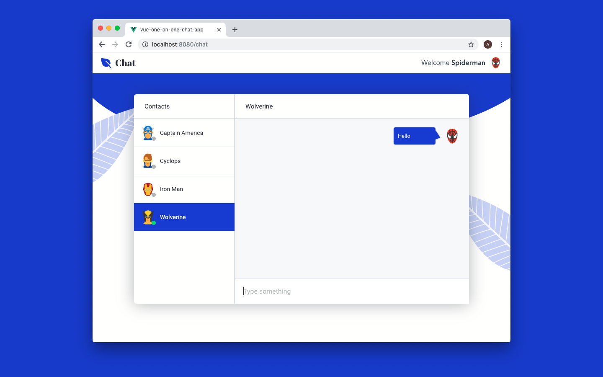

# Build one-on-one chat in your Vue app

This is the demo app that we build in the [Build one-on-one chat in your Vue app](https://www.cometchat.com/tutorials/build-one-on-one-vue-chat-app/) tutorial.



## Technology
This demo uses:
* [Vue.js](https://vuejs.org/)
* [CometChat](https://cometchat.com/)

## Running the demo
1. Download this repository
2. Run `npm install`
3. Create `.env.local` in your root directory
4. Add the following into it:
```
VUE_APP_COMETCHAT_APP_ID = your-app-id
VUE_APP_COMETCHAT_API_KEY = your-api-key
```
5. To get `your-app-id` and `your-api-key`, go to your [CometChat dashboard](https://app.cometchat.com/#/apps)
6. Create a new app and name it whatever you want
7. Once it's created, you can see your app id below the app's name
8. Replace `your-app-id` with it
9. Click on *Explore*
10. Go to API Keys tab and use the `authOnly` key as `your-api-key` in your `.env.local`
11. Run the app using `npm run serve`
12. View the app on http://localhost:8080

## Useful links
* 🏠 [CometChat Homepage](https://www.cometchat.com/pro)
* 🚀 [Create your free account](https://app.cometchat.com/#/apps)
* 📚 [Documentation](https://prodocs.cometchat.com/docs)
* 👾 [GitHub](https://github.com/CometChat-Pro)